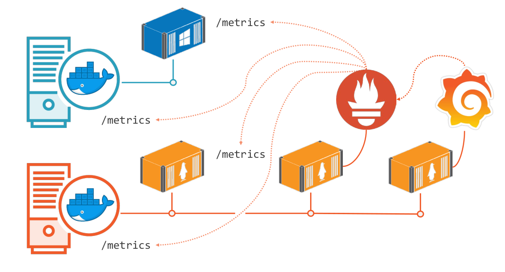
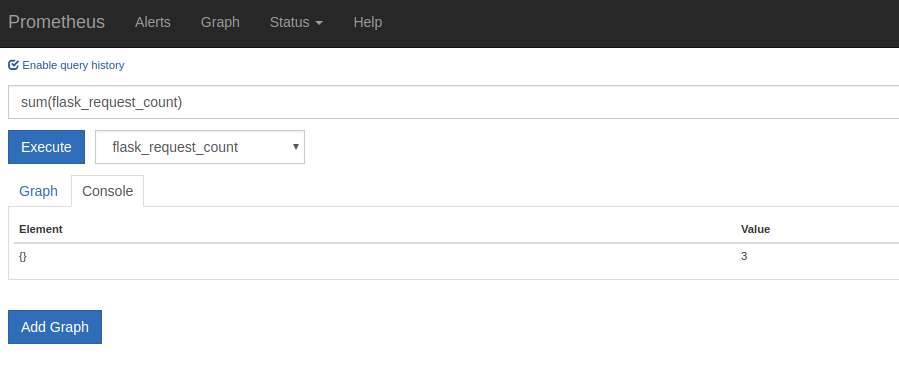
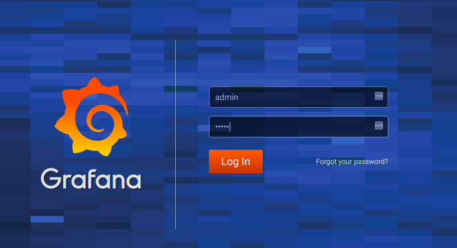
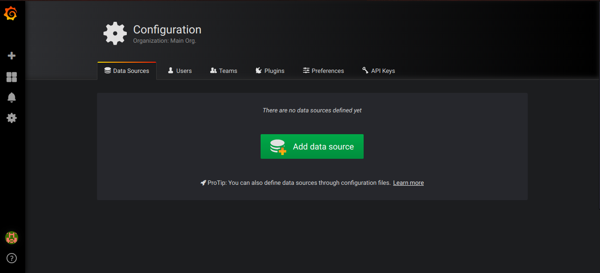
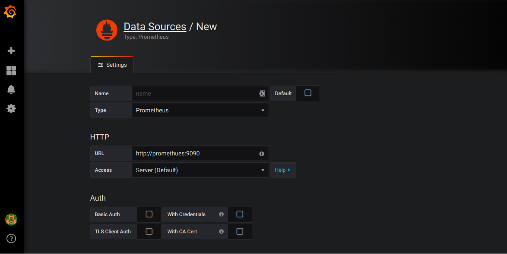
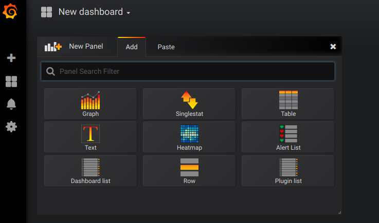
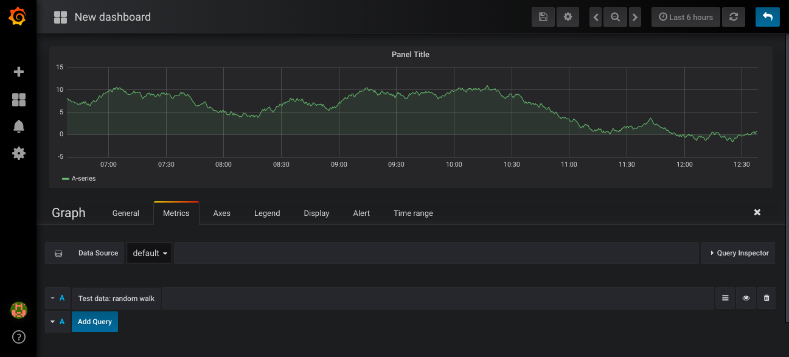
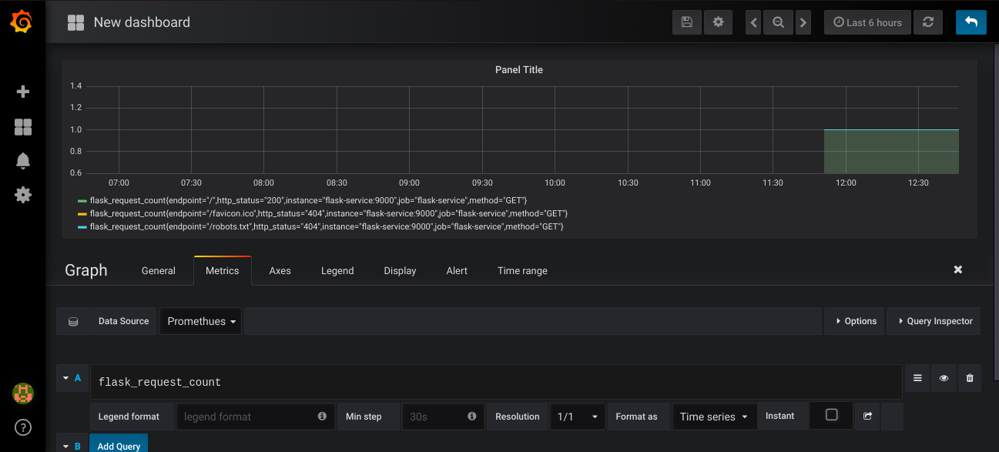

# Monitoring Containerized Applications

This is a demonstration on how to collect runtime metrics from a Flask app with prometheus and visualize them using Grafana. 

### Prerequisites

What things you need to install to get this code running in your machine

* [Docker](https://www.docker.com/get-started) - Containerization technology
* [Docker compose](https://docs.docker.com/compose/install/) - Allows you to spin up multiple containers running in the same network

Other tools used which do not require an install because docker will do it for you:

* [Prometheus](https://prometheus.io/) - Metrics collection server
* [Grafana](https://grafana.com/) - Metrics visualizer

After the two installs do

```
$ git clone git@github.com:ShemManyu/devfest-2018-docker-monitoring-session.git
```
And change into the directory 

```
$ cd devfest-2018-docker-monitoring-session
```

Now to get everything started 

```
$ docker-compose up
```
This is an overview of the architecture



The application needs to expose an endpoint which gives its metrics, prometheus scrapes theses metrics after a specified interval and stores them in a time series
database. Grafana then gets these metrics from prometheus and visualizes them.

The flask app should run on ```localhost:8000``` and expose its metrics on ```localhost:9000```. Check them out.
We can keep track of the number of requests our simple flask app is getting by keeping track of ```flask_request_count``` metric.
Check prometheus which should be running in ```localhost:9090``` and select this metric on the drop down list. When you click execute it will show you the 
count from the last time it scraped the app.
Prometheus supports complex queries but were keeping it simple here. Load ```localhost:8000``` a few more times to increase the request count
and type the query ```sum(flask_request_count)``` in prometheus and click execute this should give you the total requests and should increase after you load
```localhost:8000```



We can now graph this metric with grafana which should be running in ```localhost:3000```.
Use the default credentials admin/admin to login and you can skip the password change.



We first need to tell grafana where to get the metrics. Click on ```datasources``` and add prometheus





Save and test.

Now we can add a graph to visualize this metric

Dashboards home > New dashboard



Choose graph
Then click on panel title > Edit
And you should be here



We can now add our prometheus data source in the drop down and a query to get the data we want to display which was flask_request_count
https://www.docker.com/get-started


We can how monitor how the requests to our service are changing over time.

For more checkout @sixeyed 's awesome [pluralsight course](https://app.pluralsight.com/library/courses/monitoring-containerized-app-health-docker/table-of-contents)
